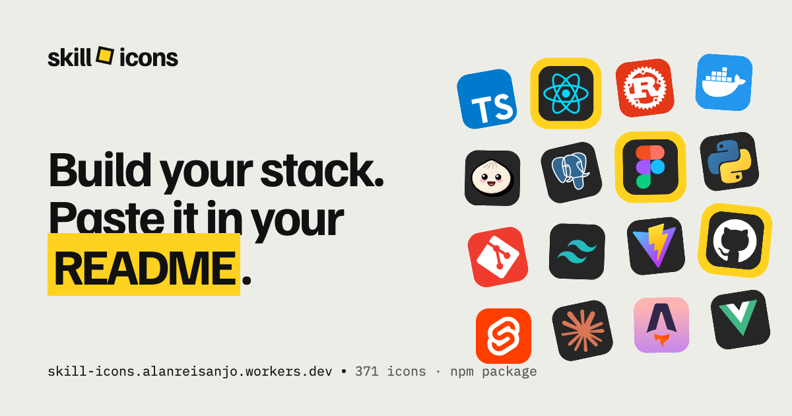

<p align="center">
  <a href="https://skill-icons.alanreisanjo.workers.dev">
    <picture>
      <source media="(prefers-color-scheme: dark)" srcset="./public/og-site-dark.png">
      
    </picture>
  </a>
</p>
<h3 align="center">Showcase your skills on your GitHub or resumé with ease!</h3>

<p align="center">
  <a href="https://www.npmjs.com/package/@hoyasumii/skill-icons"></a>
  <a href="https://github.com/Hoyasumii/skill-icons/actions/workflows/deploy.yml"></a>
  <a href="./LICENSE"></a>
</p>

<hr>

<h3 align="center">Powered by Cloudflare Workers ⚡</h3>

> [!NOTE]
> This project is a fork of [tandpfun/skill-icons](https://github.com/tandpfun/skill-icons), the original Skill Icons by [tandpfun](https://github.com/tandpfun). This fork adds a visual builder, more icons and the [`@hoyasumii/skill-icons`](https://www.npmjs.com/package/@hoyasumii/skill-icons) npm package. All credit for the original project and icons goes to its authors.

Skill Icons gives you 370+ icons in a few ways:

- **An image API**: paste a URL into your README and get an SVG with your skills. Shared on Discord, Slack, X and other apps, the same link unfurls into a preview card.
- **A [visual builder](https://skill-icons.alanreisanjo.workers.dev)**: search icons, start from ready-made stacks, save your own, and copy the Markdown, HTML or package code.
- **An npm package**, [`@hoyasumii/skill-icons`](https://www.npmjs.com/package/@hoyasumii/skill-icons): the same icons as components for React, Vue, Svelte, Angular, Solid, Astro and Web Components.
- **An MCP server**: let Claude and other AI assistants find icon ids and build the badge for you.

> [!IMPORTANT]
> To keep icons consistent and to ensure browser support, we don't accept pull requests for icon submissions. If you would like an icon added, please open an issue.

# Docs

- [Example](#example)
- [Builder](#builder)
- [Specifying Icons](#specifying-icons)
- [Themed Icons](#themed-icons)
- [Icons Per Line](#icons-per-line)
- [Centering Icons](#centering-icons)
- [Badge Title](#badge-title)
- [Link Previews](#link-previews)
- [npm Package](#npm-package)
- [MCP Server](#mcp-server)
- [Icons List](#icons-list)
- [Development](#development)
- [Releasing](#releasing)

# Example

<p align="center"></p>
<p align="center"></p>

# Builder

The [builder](https://skill-icons.alanreisanjo.workers.dev) is the easiest way to make a badge:

- Search icons by name or alias, or browse them by category.
- Start from a ready-made stack and combine as many as you like.
- Reorder or remove icons in your stack, pick the theme and icons per line, and give the badge a title.
- Save stacks in your browser to come back to them later.
- Export as Markdown or HTML for your README, or as code for the npm package.

The site is available in [English](https://skill-icons.alanreisanjo.workers.dev) and [Portuguese (Brazil)](https://skill-icons.alanreisanjo.workers.dev/pt-BR/); each language has its own address.

# Specifying Icons

Copy and paste the code block below into your readme to add the skills icon element!

Change the `?i=js,html,css` to a list of your skills separated by ","s! You can find a full list of icons [here](#icons-list).

```md
[](https://skill-icons.alanreisanjo.workers.dev)
```

[](https://skill-icons.alanreisanjo.workers.dev)

# Themed Icons

Some icons have a dark and light themed background. You can specify which theme you want as a url parameter.

This is optional. The default theme is dark.

Change the `&theme=light` to either `dark` or `light`. The theme is the background color, so light theme has a white icon background, and dark has a black-ish.

**Light Theme Example:**

```md
[](https://skill-icons.alanreisanjo.workers.dev)
```

[](https://skill-icons.alanreisanjo.workers.dev)

# Icons Per Line

You can specify how many icons you would like per line! It's an optional argument, and the default is 15.

Change the `&perline=3` to any number between 1 and 50.

```md
[](https://skill-icons.alanreisanjo.workers.dev)
```

[](https://skill-icons.alanreisanjo.workers.dev)

# Centering Icons

Want to center the icons in your readme? The SVGs are automatically resized, so you can do it the same way you'd normally center an image.

```html
<p align="center">
  <a href="https://skill-icons.alanreisanjo.workers.dev">
    
  </a>
</p>
```

<p align="center">
  <a href="https://skill-icons.alanreisanjo.workers.dev">
    
  </a>
</p>

# Badge Title

Add `&title=` to name your badge (up to 40 characters). The SVG looks the same; the title is used as the heading of the [link preview](#link-previews) card. The builder also uses it as the image's alt text.

```md
[](https://skill-icons.alanreisanjo.workers.dev)
```

# Link Previews

An `/icons` link works in more places than a README:

- **Images** (``, Markdown images, GitHub's image proxy) get the SVG.
- **Chat and social apps** (Discord, Slack, X, WhatsApp, Telegram, LinkedIn, Bluesky and others) get a preview card with your icons, the badge title and the link. The card image is also available directly at `/og?i=…`.
- **People opening the link** in a browser are sent to the builder.

Cards are light by default. Add `&bg=dark` to an `/icons` link for a dark card, or `?bg=dark` to a link to the site itself (`https://skill-icons.alanreisanjo.workers.dev/?bg=dark`) to share it with the dark cover.

# npm Package

The icons are also published as [`@hoyasumii/skill-icons`](https://www.npmjs.com/package/@hoyasumii/skill-icons), with one entry point per framework. Icons are bundled with the package and each one is loaded as its own chunk, only when rendered.

```sh
npm install @hoyasumii/skill-icons   # or: pnpm add / yarn add / bun add
```

```tsx
import { Icon, Icons } from '@hoyasumii/skill-icons/react';

<Icon name="react" />
<Icon name="ts" theme="light" size={32} />
<Icons names={['js', 'ts', 'react']} perLine={2} />
```

| Entry point                      | For                                                       |
| -------------------------------- | --------------------------------------------------------- |
| `@hoyasumii/skill-icons/react`   | React 18+                                                 |
| `@hoyasumii/skill-icons/vue`     | Vue 3.3+                                                  |
| `@hoyasumii/skill-icons/svelte`  | Svelte 5+                                                 |
| `@hoyasumii/skill-icons/angular` | Angular 17.1+ (standalone components)                     |
| `@hoyasumii/skill-icons/solid`   | Solid 1.8+                                                |
| `@hoyasumii/skill-icons/astro`   | Astro 4+ (server rendered, no client JS)                  |
| `@hoyasumii/skill-icons/element` | Framework-free custom elements (`<skill-icon>`)           |
| `@hoyasumii/skill-icons`         | `renderIcon` / `renderIcons` to HTML strings (SSR, email) |

Names are typed, `theme` accepts `'dark'`, `'light'` or `'auto'`, and `latest` mode loads icons from the API so new icons work without updating the package. See the [package README](./packages/skill-icons/README.md) for the full docs.

# MCP Server

Skill Icons is also a remote [MCP](https://modelcontextprotocol.io) server, so Claude and other AI assistants can find icon ids and build your badge for you. Open [the MCP page](https://skill-icons.alanreisanjo.workers.dev/mcp) for step-by-step instructions, or add it to Claude Code:

```bash
claude mcp add --transport http skill-icons https://skill-icons.alanreisanjo.workers.dev/mcp
```

In the Claude app, add `https://skill-icons.alanreisanjo.workers.dev/mcp` as a custom connector in Settings → Connectors. It is free and needs no API key. The tools are `skill_icons_search` (find icons by id, brand name or alias) and `skill_icons_badge` (turn a list of icons into the image URL, Markdown and HTML, with suggestions for any name that does not match).

# Icons List

Here's a list of all the icons currently supported. Feel free to open an issue to suggest icons to add!

Short aliases also work: `js`, `ts`, `py`, `k8s`, `postgres`, `tailwind`, `next` and more (see `shortNames` in [`shared/icons.ts`](./shared/icons.ts)).

|     Icon ID     |                                         Icon                                         |      Icon ID       |                                            Icon                                            |
| :-------------: | :----------------------------------------------------------------------------------: | :----------------: | :----------------------------------------------------------------------------------------: |
|  `abacatepay`   |        |     `ableton`      |                    |
|  `activitypub`  |      |      `actix`       |                        |
|    `adonis`     |                |      `adyen`       |                        |
| `aftereffects`  |    |     `aiscript`     |                  |
|   `alpinejs`    |            |     `anaconda`     |                  |
|    `android`    |              |  `androidstudio`   |        |
|    `angular`    |              |     `ansible`      |                    |
|  `antigravity`  |      |      `apollo`      |                      |
|     `apple`     |                  |     `applepay`     |                  |
|   `appwrite`    |            |       `arch`       |                          |
|    `arduino`    |              |      `argocd`      |                      |
|     `astro`     |                  |       `atom`       |                          |
|   `audition`    |            |      `auth0`       |                        |
|    `authjs`     |                |     `autocad`      |                    |
|      `aws`      |                      |       `azul`       |                          |
|     `azure`     |                  |      `babel`       |                        |
|     `bash`      |                    |    `betterauth`    |              |
|     `bevy`      |                    |      `biome`       |                        |
|   `bitbucket`   |          |     `blender`      |                    |
|    `bluesky`    |              |    `bootstrap`     |                |
|      `bsd`      |                      |       `bun`        |                            |
|       `c`       |                          |      `canva`       |                        |
|   `cassandra`   |          |     `chatgpt`      |                    |
|    `claude`     |                |      `clerk`       |                        |
|  `clickhouse`   |        |      `cline`       |                        |
|     `clion`     |                  |     `clojure`      |                    |
|  `cloudflare`   |        |      `cmake`       |                        |
|    `codepen`    |              |      `codex`       |                        |
| `coffeescript`  |    |      `convex`      |                      |
|    `coolify`    |              |       `cpp`        |                            |
|    `crystal`    |              |        `cs`        |                              |
|      `css`      |                      |      `cursor`      |                      |
|    `cypress`    |              |        `d3`        |                              |
|    `daisyui`    |              |       `dart`       |                          |
|    `datadog`    |              |     `datagrip`     |                  |
|    `debian`     |                |     `deepseek`     |                  |
|    `defold`     |                |       `deno`       |                          |
|     `devto`     |                  |   `digitalocean`   |          |
|    `discord`    |              |   `discordbots`    |            |
|   `discordjs`   |          |      `django`      |                      |
|    `docker`     |                |    `docusaurus`    |              |
|    `dotnet`     |                |     `drizzle`      |                    |
|    `duckdb`     |                |     `dynamodb`     |                  |
|    `eclipse`    |              |  `elasticsearch`   |        |
|   `electron`    |            |      `elixir`      |                      |
|    `elysia`     |                |      `emacs`       |                        |
|     `ember`     |                  |     `emotion`      |                    |
|    `esbuild`    |              |      `eslint`      |                      |
|     `expo`      |                    |    `expressjs`     |                |
|    `fastapi`    |              |     `fastify`      |                    |
|   `fediverse`   |          |      `fiber`       |                        |
|     `figma`     |                  |     `firebase`     |                  |
|     `flask`     |                  |     `flutter`      |                    |
|      `fly`      |                      |      `forth`       |                        |
|    `fortran`    |              | `gamemakerstudio`  |    |
|    `gatsby`     |                |       `gcp`        |                            |
|    `gemini`     |                |     `gherkin`      |                    |
|      `gin`      |                      |       `git`        |                            |
|    `github`     |                |  `githubactions`   |        |
| `githubcopilot` |  |      `gitlab`      |                      |
|     `gleam`     |                  |      `gmail`       |                        |
|     `godot`     |                  |      `goland`      |                      |
|    `golang`     |                |    `googlepay`     |                |
|    `gradle`     |                |     `grafana`      |                    |
|    `graphql`    |              |       `grok`       |                          |
|      `gtk`      |                      |       `gulp`       |                          |
|    `haskell`    |              |       `haxe`       |                          |
|  `haxeflixel`   |        |      `helix`       |                        |
|     `helm`      |                    |      `heroku`      |                      |
|   `hibernate`   |          |       `hono`       |                          |
|     `html`      |                    |       `htmx`       |                          |
|  `huggingface`  |      |      `husky`       |                        |
|     `idea`      |                    |   `illustrator`    |            |
|   `inkscape`    |            |    `instagram`     |                |
|      `ios`      |                      |       `ipfs`       |                          |
|     `java`      |                    |    `javascript`    |              |
|    `jenkins`    |              |       `jest`       |                          |
|     `jira`      |                    |      `jquery`      |                      |
|     `json`      |                    |      `julia`       |                        |
|    `jupyter`    |              |      `kafka`       |                        |
|     `kali`      |                    |     `keycloak`     |                  |
|     `knip`      |                    |      `kotlin`      |                      |
|     `ktor`      |                    |    `kubernetes`    |              |
|   `langchain`   |          |     `langfuse`     |                  |
|    `laravel`    |              |      `latex`       |                        |
| `lemonsqueezy`  |    |       `less`       |                          |
|    `linear`     |                |     `linkedin`     |                  |
|     `linux`     |                  |       `lit`        |                            |
|      `lua`      |                      |      `macos`       |                        |
|    `mariadb`    |              |     `markdown`     |                  |
|  `mastercard`   |        |     `mastodon`     |                  |
|  `materialui`   |        |      `matlab`      |                      |
|     `maven`     |                  |       `mcp`        |                            |
|  `mercadopago`  |      |       `mint`       |                          |
|    `misskey`    |              |      `mocha`       |                        |
|     `mojo`      |                    |     `mongodb`      |                    |
|     `mysql`     |                  |       `n8n`        |                            |
|     `neo4j`     |                  |       `neon`       |                          |
|    `neovim`     |                |      `nestjs`      |                      |
|    `netlify`    |              |      `nextjs`      |                      |
|     `nginx`     |                  |       `nim`        |                            |
|      `nix`      |                      |      `nodejs`      |                      |
|    `notion`     |                |       `npm`        |                            |
|    `nubank`     |                |      `numpy`       |                        |
|    `nuxtjs`     |                |        `nx`        |                              |
|   `obsidian`    |            |      `ocaml`       |                        |
|    `octave`     |                |      `ollama`      |                      |
|    `openai`     |                |     `openclaw`     |                  |
|   `opencode`    |            |      `opencv`      |                      |
|   `openshift`   |          |    `openstack`     |                |
| `opentelemetry` |  |      `oxlint`      |                      |
|     `p5js`      |                    |      `paddle`      |                      |
|   `pagseguro`   |          |      `pandas`      |                      |
|    `paypal`     |                |       `perl`       |                          |
|  `perplexity`   |        |    `photoshop`     |                |
|      `php`      |                      |     `phpstorm`     |                  |
|     `pinia`     |                  |       `pix`        |                            |
|      `pkl`      |                      |      `plan9`       |                        |
|     `plane`     |                  |   `planetscale`    |            |
|  `playwright`   |        |       `pnpm`       |                          |
|  `pocketbase`   |        |      `polar`       |                        |
|  `postgresql`   |        |     `posthog`      |                    |
|    `postman`    |              |    `powershell`    |              |
|   `premiere`    |            |     `prettier`     |                  |
|    `prisma`     |                |    `processing`    |              |
|  `prometheus`   |        |       `pug`        |                            |
|   `puppeteer`   |          |     `pycharm`      |                    |
|    `pytest`     |                |      `python`      |                      |
|    `pytorch`    |              |        `qt`        |                              |
|       `r`       |                          |     `rabbitmq`     |                  |
|    `radixui`    |              |      `rails`       |                        |
|    `railway`    |              |   `raspberrypi`    |            |
|   `razorpay`    |            |      `react`       |                        |
|   `reactivex`   |          |   `reactnative`    |            |
|  `reactquery`   |        |      `reddit`      |                      |
|    `redhat`     |                |      `redis`       |                        |
|     `redux`     |                  |      `regex`       |                        |
|     `remix`     |                  |      `replit`      |                      |
|    `resend`     |                |      `rider`       |                        |
| `robloxstudio`  |    |      `rocket`      |                      |
|   `rollupjs`    |            |       `ros`        |                            |
|    `rspack`     |                |       `ruby`       |                          |
|     `rust`      |                    |       `sass`       |                          |
|     `scala`     |                  |   `scikitlearn`    |            |
|   `selenium`    |            |      `sentry`      |                      |
|   `sequelize`   |          |     `shadcnui`     |                  |
|    `signoz`     |                |      `sketch`      |                      |
|   `sketchup`    |            |      `slack`       |                        |
|   `solidity`    |            |     `solidjs`      |                    |
|    `spotify`    |              |      `spring`      |                      |
|      `sql`      |                      |      `sqlite`      |                      |
|   `sqlserver`   |          |      `square`      |                      |
| `stackoverflow` |  |    `starlight`     |                |
|   `storybook`   |          |      `strapi`      |                      |
|    `stripe`     |                | `styledcomponents` |  |
|    `sublime`    |              |     `supabase`     |                  |
|    `svelte`     |                |       `svg`        |                            |
|      `swc`      |                      |      `swift`       |                        |
|    `symfony`    |              |   `tailwindcss`    |            |
|   `tanstack`    |            |      `tauri`       |                        |
|   `telegram`    |            |    `tensorflow`    |              |
|   `terraform`   |          |  `testinglibrary`  |      |
|    `threejs`    |              |       `trae`       |                          |
|    `traefik`    |              |       `trpc`       |                          |
|   `turbopack`   |          |    `turborepo`     |                |
|     `turso`     |                  |     `twitter`      |                    |
|  `typescript`   |        |      `ubuntu`      |                      |
|     `unity`     |                  |   `unrealengine`   |          |
|    `upstash`    |              |        `v`         |                                |
|     `vala`      |                    |      `vercel`      |                      |
|    `verilog`    |              |       `vim`        |                            |
|     `visa`      |                    |   `visualstudio`   |          |
|     `vite`      |                    |      `vitest`      |                      |
|    `vscode`     |                |     `vscodium`     |                  |
|     `vuejs`     |                  |     `vuetify`      |                    |
|     `warp`      |                    |   `webassembly`    |            |
|    `webflow`    |              |     `webpack`      |                    |
|   `webstorm`    |            |     `whatsapp`     |                  |
|   `windicss`    |            |     `windows`      |                    |
|   `windsurf`    |            |    `wordpress`     |                |
|    `workers`    |              |      `xcode`       |                        |
|      `xd`       |                        |       `yaml`       |                          |
|     `yarn`      |                    |       `yew`        |                            |
|    `youtube`    |              |       `zed`        |                            |
|      `zig`      |                      |       `zod`        |                            |
|    `zustand`    |              |                    |                                                                                            |

# Development

The site (builder) and the API run on the same Cloudflare Worker. The npm package lives in `packages/skill-icons`, a Bun workspace. Requires [Bun](https://bun.sh).

```sh
bun install
bun run dev        # site + API at http://localhost:5173
bun run test       # Worker tests, running inside workerd
bun run typecheck
bun run preview    # production build, served locally
bun run deploy
```

Package:

```sh
bun run build:lib      # builds packages/skill-icons/dist
bun run test:lib       # package tests
bun run typecheck:lib  # tsc, vue-tsc, ngc, svelte-check, astro check
bun run pack:lib       # builds and lists the files that would be published
```

### Generating an icon

`skill-icon` wraps any logo SVG in the standard 256×256 rounded container and writes it to `./icons/`:

```sh
bun skill-icon generate --name Spotify --generate ./spotify.svg --category social                       # icons/Spotify-Dark.svg + icons/Spotify-Light.svg
bun skill-icon generate --name Spotify --generate ./spotify.svg --category social --background "#1ED760" # icons/Spotify.svg
bun skill-icon category list                                                                            # available categories
```

`--name`, `--generate` and `--category` are required. The icon is also registered in `shared/icon-categories.ts`. Add `--force` to overwrite existing files. Run `bun run icons` (or `dev`/`build`) afterwards to update `public/svg/` and the package's generated icons.

### Icon Manager (macOS app)

> [!NOTE]
> **Skill Icons Manager** is a small macOS app for maintaining this repo's icons. It is a tool for contributors working on a clone, not part of the site or the package. It needs macOS 13 or newer and works on Apple silicon and Intel Macs.

What it does:

- **Icons**: browse every SVG in `icons/` and switch between the Dark and Light variants. Select icons and group them into stacks, then copy a stack as an array of paths, relative (`icons/…`) or absolute: `{ "light": "…", "dark": "…" }` for themed icons, a plain string for icons without a theme. The grid updates as soon as a file in `icons/` changes. Stacks are saved per user, outside the repo.
- **Candidates**: the shared to-do list of icons to add, read from and written to [`icon-candidates.json`](./icon-candidates.json), so it travels with git. Add a candidate by name, category and priority, change its status (pending → researched → added), and copy its `bun skill-icon generate` command.
- English or Portuguese, picked from the system language. Two appearances: the site's palette or native macOS with Liquid Glass (**View** menu).

**Install from a release:** download `Skill-Icons-Manager.dmg` from the [Icon Manager releases](https://github.com/Hoyasumii/skill-icons/releases?q=manager-v), open it and drag the app to **Applications**. On first launch it asks for your skill-icons clone. The app isn't notarized, so macOS blocks the first launch: open **System Settings → Privacy & Security** and click **Open Anyway**, or run `xattr -dr com.apple.quarantine "/Applications/Skill Icons Manager.app"`.

**Build it yourself** (needs the Xcode Command Line Tools: `xcode-select --install`):

```sh
bun run manager        # builds the app and opens the DMG: drag it to Applications
bun run manager:build  # only the app, in tools/icon-manager/build/
bun run manager:dmg    # app + tools/icon-manager/build/Skill-Icons-Manager.dmg
```

A local build already knows where your clone is. Building the DMG lays out its window through Finder, so macOS may ask to let your terminal control Finder.

| Path                    | Description                                                               |
| ----------------------- | ------------------------------------------------------------------------- |
| `icons/`                | Source SVGs                                                               |
| `scripts/`              | Generates `generated/`, `public/svg/` and the package icons from `icons/` |
| `worker/`               | API: `/icons`, `/og`, `/mcp`, `/api/icons`, `/api/svgs`                   |
| `src/`                  | Builder site (React, TypeScript, Tailwind, shadcn/ui)                     |
| `shared/`               | Code shared by both (aliases, categories, URL builder, MCP, page meta)    |
| `packages/skill-icons/` | The `@hoyasumii/skill-icons` npm package                                  |
| `tools/icon-manager/`   | Skill Icons Manager, the macOS app for maintaining icons                  |

# Releasing

The package is published to npm by [`.github/workflows/release.yml`](./.github/workflows/release.yml) when a `v*` tag is pushed. The workflow checks that the tag matches the package version, runs the package typecheck and tests, builds, publishes with provenance and creates a GitHub release.

```sh
# 1. bump "version" in packages/skill-icons/package.json, then:
git commit -am "chore: release v0.1.1"
git tag v0.1.1
git push origin main v0.1.1
```

Publishing uses [npm trusted publishing](https://docs.npmjs.com/trusted-publishers) (OIDC), so no token is stored in the repository. One-time setup:

1. Publish the first version manually: `cd packages/skill-icons && npm publish` (the `prepack` script builds it).
2. On npmjs.com, open the package settings → **Trusted Publisher** → GitHub Actions, with repository `Hoyasumii/skill-icons` and workflow `release.yml`.

### Icon Manager

[`.github/workflows/manager-release.yml`](./.github/workflows/manager-release.yml) builds the app on macOS and attaches the DMG to a GitHub release when a `manager-v*` tag is pushed. These tags don't match `v*`, so they never publish to npm. You can also run the workflow by hand from the Actions tab and download the DMG from the run's artifacts.

```sh
git tag manager-v1.0.0
git push origin manager-v1.0.0
```

---

## 💖 Support the Project

Thank you so much already for using my projects! If you want to go a step further and support my open source work, buy me a coffee:

<a href='https://ko-fi.com/Q5Q860KQ2' target='_blank'></a>

To support the project directly, feel free to open issues for icon suggestions, or contribute with a pull request!

Before contributing, read [CONTRIBUTING.md](CONTRIBUTING.md). Everyone taking part is expected to follow the [Code of Conduct](CODE_OF_CONDUCT.md), and security problems go through [SECURITY.md](SECURITY.md).
